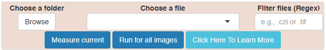
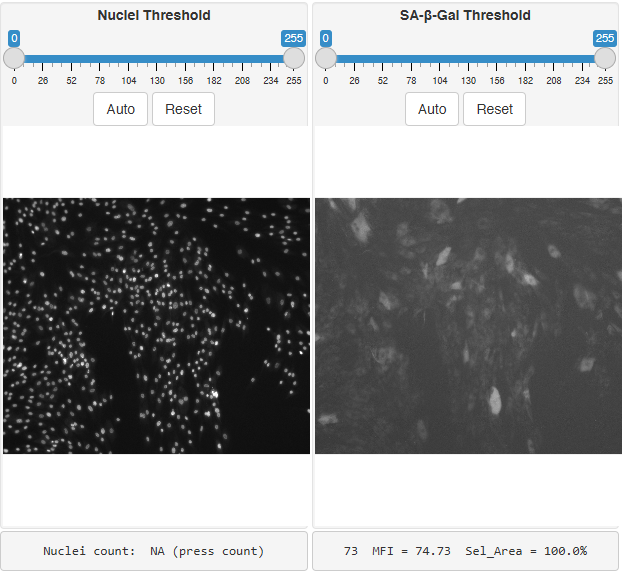
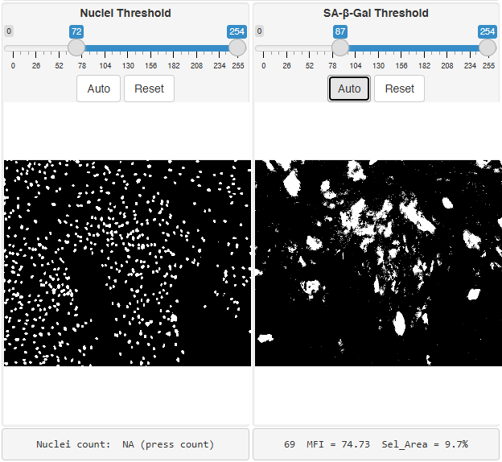
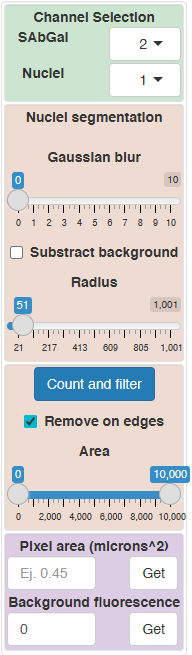
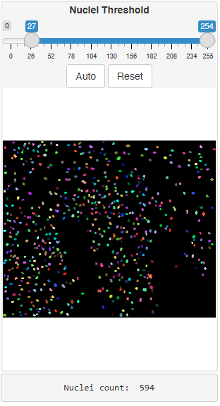
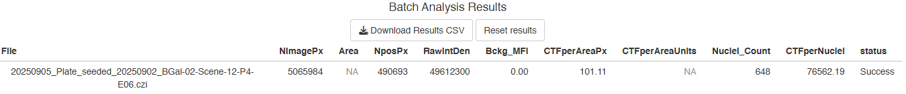

# FABGAL Help Page
Alejandro P. Ugalde, Antonio Garcia-Bernardo Tartiere, David Roiz del
Valle

# What is FABGal

FABGal is an interactive tool for the analysis of the
senescence-associated X-Gal beta-galactosidase assay recorded using the
natural fluorescence of the X-Gal product indigo in a wide-field
fluorescence microscope, as described in [Tartiere et al](paper%20link).
This tool expects single or multichannel tiff files containing the
fluorescence image of the SABGAL assay, and, optionally, the
fluorescence image of a nuclear marker (e.g. DAPI or Hoeschst). The
interactive interface allows users to set thresholds and other settings
and carry out measurements of individual files or run batch analyses of
multiple images.

# Description of FABGAL app

## Input files section

To start using this tool, first use the browse button to select a local
folder from your computer containing your image files. The app will scan
the folder and display your image files in the dropdown field “Choose a
file”. Additionally, you can introduce a
[regex](https://www.rdocumentation.org/packages/base/versions/3.6.2/topics/regex)
in the “Filter files (Regex)” field to select a subset of your files
(e.g. \*.tif). To start interacting with your images, select a single
file from the dropdown menu.

## Image display section

Once a file is selected, the individual channels will be shown on the
“display and thresholding section”. By default, if the file has at least
two channels, channel 1 will be considered the nuclei marker and channel
2 will be considered the SABGAL image, but you can change this in the
lateral panel (see bellow). This section also includes sliders to
interactively set a threshold. By default, no threshold is selected and
the original image channels are shown (in grayscale).

Once the user starts moving the sliders, the display will update and
show the positively selected areas (in white over black background).
Users can use the “Auto” button to guess the best threshold using the
otsu method, but fine tuning using the sliders will be required in most
cases.

The following image shows an example after using the auto threshold
options for both channels. As you can see, below the SABGAL image some
statistics are displayed: the intensity value of the pixel under the
cursor, the MFI (mean fluorescence intensity of the whole image) and
Sel_area (percentage of selected area by the threshold). The nuclei
channel does not show any statistics until the user press the “Count and
filter” button in the lateral panel (see below)

## Side bar panel

The first section of the sidebar panel is the channel selection. The app
will show you dropdown menus to select the channel for the nuclei and
SAbGal images.

Next comes the section for **Nuclei segmentation**. You can move the
**“Gaussian blur”** slider to apply a blur of that radius to the nuclei
image before segmentation (it can help with noisy images).

The **“subtract background”** option can be very useful. It applies a
balling roll algorithm (similar to the ImageJ subtract background) that
helps when images have different density of nuclei or there is
cytoplasmic halo. You will notice that if you enable this option, the
thresholding will require further adjustment.

Once you have set the nuclei options and a proper threshold, press
**“Count and filter”** to run the nuclei segmentation previsualization.
The nuclei will display now with color labels to help distinguishing
individual objects, and the number of detected nuclei will be displayed
bellow the nuclei image.

Sometimes there are nuclei clumps or small fragments detected as nuclei.
Use the Area (number of pixels) slider to filter out those artifacts.
You will see that the nuclei count update in real time. Finally, by
default, incomplete cells in the edges of the image are filtered out,
but you can include them if you disable the **“Remove on edges”** check
option.

This image below represents the result after click “Count and filter”.
If you modify the threshold or press reset, the app will display again
the thresholded (black and white) image (just for speeding up
interactivity). Press again “Count and filter” to see the segmentation
previsualization.

Finally, the last section of the sidebar panel is dedicated for analysis
options. In the first field, **“Pixel Area (in microns^2)”**, you can
introduce the pixel area in squared microns, if you know it. You can
also use the “**Get**” button to try to extract it from the image
metadata, but it does not always work, since each writer populate the
metadata differently. If that does not work, you can use FIJI-ImageJ and
find the pixel width and height under Image\>properties. The pixel area
is the product of the pixel’s width and height.

Another important field in this section is the “**Background MFI (mean
fluorescence intensity)**”. This value (default is zero) is subtracted
from the total fluorescence intensity of your experimental images to
calculate the corrected total intensity (CTF). You should use a
background image (a picture taken with the same settings in an area
without cells and debri) to find this value. As a helper, the “**Get**”
button extract the MFI from a background image that is loaded in the
app.

## Single image and batch analysis

Once you have your settings set, you can click on “**Measure**” to
process the current image. A result table will be shown bellow the image
display section. You can now select another file from the dropdown and
press “Measure” again to run the same settings. The measurement will be
added to the previous results. If you want to clear the table, use the
reset button.

If you are happy with the results, you can click on “**Run for all
images**” and the app will start measuring all files with the current
settings.

## Results section

If you use the “Measure” or “Run for all images” buttons, a result table
will displayed at the bottom of the app. The fields are:

|  |  |
|------------------------------------|------------------------------------|
| File | Filename |
| NimagePx | Total number of pixels of your image |
| Area | Image area in squared micrometers (if pixel size was provided) |
| NposPx | Number of positive (selected) pixels for the SABGal channel |
| RawIntDen | Sum of pixel intensities of positive pixels for SABGAL staining |
| Bckg_MFI | Background MFI used in the calculation (supplied by the user) |
| CTFperAreaPixel | Corrected total fluorescence per area (in pixels) |
| CTFperAreaUnit | Corrected total fluorescence per area (in squared micromiters) |
| Nuclei_Count | Number of detected nuclei |
| CTFperNuclei | Average Corrected total fluorescence per nucleous |
| Status | Success if no errors have been detected. Otherwise the error message of the app. |
